# RP2040 DBUG Probe

> Some images in the journal are unavailable due to a CDN issue. 

## 25 December, 2025 - Designing The PCB

I broke my old UART to USB adapter and recently saw an article about the [Raspberry Pi Debug Probe](https://www.raspberrypi.com/documentation/microcontrollers/debug-probe.html) and though why not make one myself 🤔

So that's exactly what I did; I started off with just researching about the Debug probe and was figuring out how exactly to execute this project, and luckily for me the schematics were open sourced for the debug probe. 
It was a really simple board with just a RP2040, some passive, a LDO and headers!! And so the journey began, I started off with the minimal RP2040 schematics which I copied off the hardware design guide, and then all I really needed to do was to add the connectors. At this point in time I referred to the Debug probe schematics and noticed that they actually included a level shifter on the RX lines of the boards, so I just decided to copy their schematics; but here's where things started getting bad, KiCad started bugging out for me, it was no longer detecting new symbols added using easyeda2kicad and that really slowed me down. I spent 30 minutes trying to solve the issue with no success, In the end I decided to reinstall easyeda2kicad and delete the old symbol and footprint folders; This initially did not work but after restarting my computer and KiCad everything started to work and I could finally finish up my schematics.

Moving on to the PCB; first step was to setup the board outline, I went with the original raspberry pi debug probe board dimensions of 22x32mm which I got from their mechanical drawing.

While doing the layout I decided to assign some net classes and color code them to visualize the layout better.

Routing the board was pretty fun. I did however had to reroute the QSPI flash traces a couple dozen times cause I kept changing the layout.

Pro Tip to anyone who's doing a RP2040/RP2350 or honestly any design where the chip more than one rail; go with a power pour as shown below. Make the outer fill region be 3v3 or whatever has the most pins and let the inner pour be the one with less pins.

Here's some routing progression pictures :D

I went with a 3V3 pour on top and a ground plane on the bottom layer, I also tried my best to keep a solid ground plane and avoid routing anything on the bottom layer, since this was a pretty easy board I managed to route everything on just two layers (this is my first 2 layer board in a very long time).

This is how the board looked after I finished routing everything up

Now all that was left to do was add some testpoints and silkscreen. I added test points for the voltage rails and the swd interface of the rp2040 itself as I couldn't route it out to some headers. For silkscreen I just added some labels for the pin headers and test points and yeah that was it, didn't really add anything as this was a pretty small board, though I might add the oshw logo on this later.

I was basically done now! all that was left to do was to get the production files and setup a github repo; but before that we must run DRC and well uh 

It's not as bad as it looks though, most of these were because I forgot to change the default  constraints in KiCad and the rest were errors because of the hole in the USB-C footprint which I just excluded.

Finished everything up by assigning lcsc numbers to components and generating a BOM

### Time Spent: 6.5 Hours
---
## 20 March, 2026  - Assembled The Board

I finally had some free time today and I didn't procrastinate and decided to finally assemble the board.

Started off by generating an interactive HTML BOM using the KiCad plugin and then used that to basically get all the components required for this out.

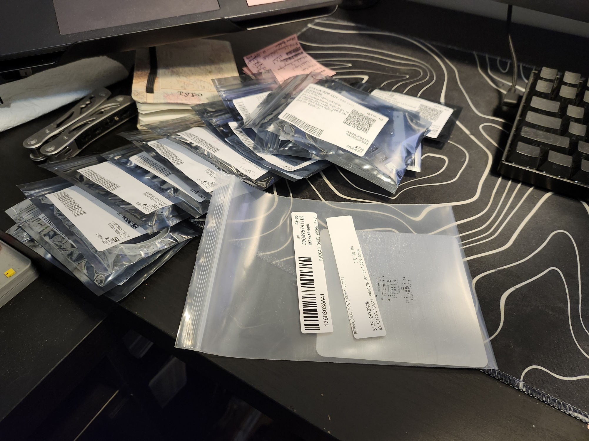

Then I went ahead and applied solder paste on the board using a stencil. It only took me about 3 tries to get the perfect amount of solder evenly on the board.

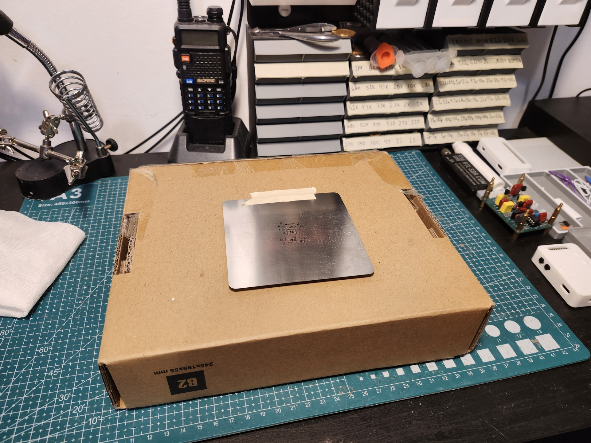

Then it was just the tedious task of picking and placing the small 0402 passives and componenets.

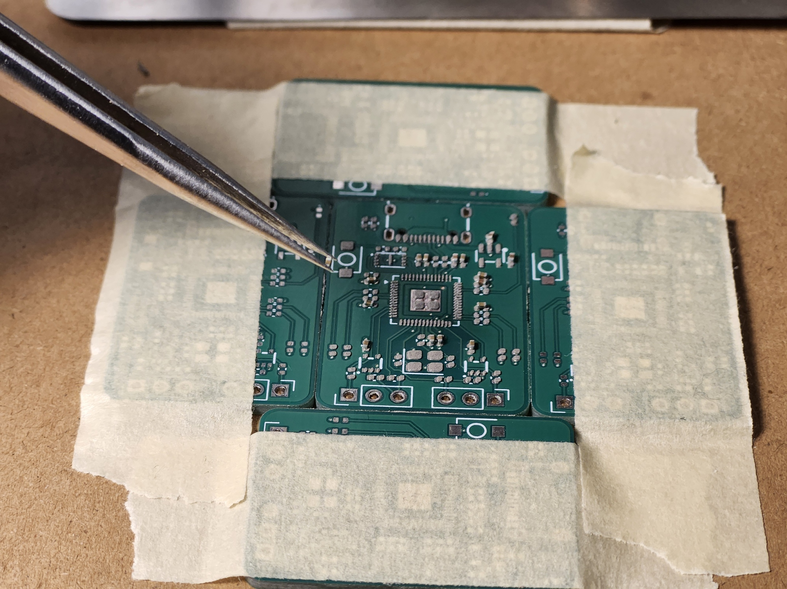

After everything was placed, the board was sent to the reflow plate, where it got cooked. After getting cooked, I visually inspected all the pads to check if there were any bridges, luckily there weren't any. Though there was a tiny blob of solder on one of the RP2040 pads (It didn't short anything), so I just put some flux, and got out the pinecil with knife tip and remove the extra solder.

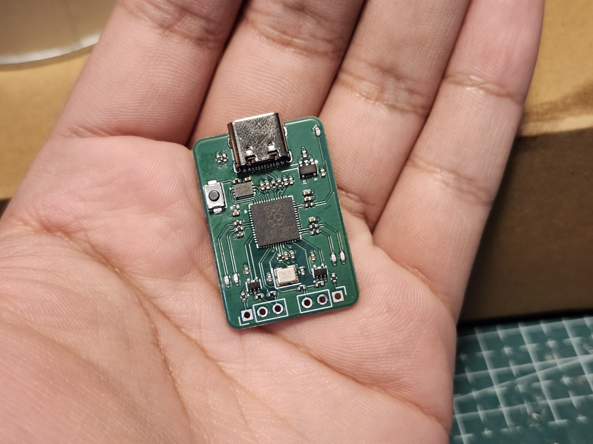

I was going to plug in the board to a usb connector, but I saw that the USB-C port was a bit shaky and it would have probably gotten ripped off if I tried to plug in anything. So I just soldered up it's mounting holes and plugged it in. 

It showed up as a RPI-RP2 which was a good sign, I flashed circuitpython on it and wrote minimal code to get one of the LED to light up and it worked :D

I quickly wrote an LED chaser effect script to test out all the LEDs, and it worked successfully.

### Time Spent: 2 Hours
---
## 21 March, 2026 - Developing Firmware

For firmware I decided to go with using the raspberry pi [Debugprobe](https://github.com/raspberrypi/debugprobe) firmware. They made it open source and it was really easy to modify it for my board.

I initially tried building it on windows but that was pretty frustrating as I had no tools installed, and it just feels weird. So I installed debian on WSL and cloned the Debugprobe repo on that, installed the pico-sdk and then modified the `board_debug_probe_config.h` file under the `include` folder with the pin definitions for my board and then built it. 

I got my `.uf2` and I flashed the RP2040 with it and everything worked perfectly :D

I loaded up teraterm to open the COM port and type something to check if it works properly, and sure enough I see a red LED blink when I send something. Although the LED was on the wrong side (that's what I though), because the silkscreen on the bottom said this was the SWD interface and not UART. So I rebuilt the firmware, and then hopped on KiCad to fix the labels, and that's when I realized that my labels were actually correct, but I had just messed up on the silkscreen. So I reverted back to the original build lmao.

After finishing firmware I went ahead and started polishing the repository, started off by making a cool pinout thingamajig in figma.

While here I also decided to make a case for it cause why not. The problem I faced was that this PCB had no mounting holes so I can't make a screw on design.

I first started off with a slide in design where the PCB can slide into a tight gap to remain secured but scrapped that as It was a pretty weird thing to implement in fusion and in the end it didn't even look cool.

*scrapped slide in case idea*
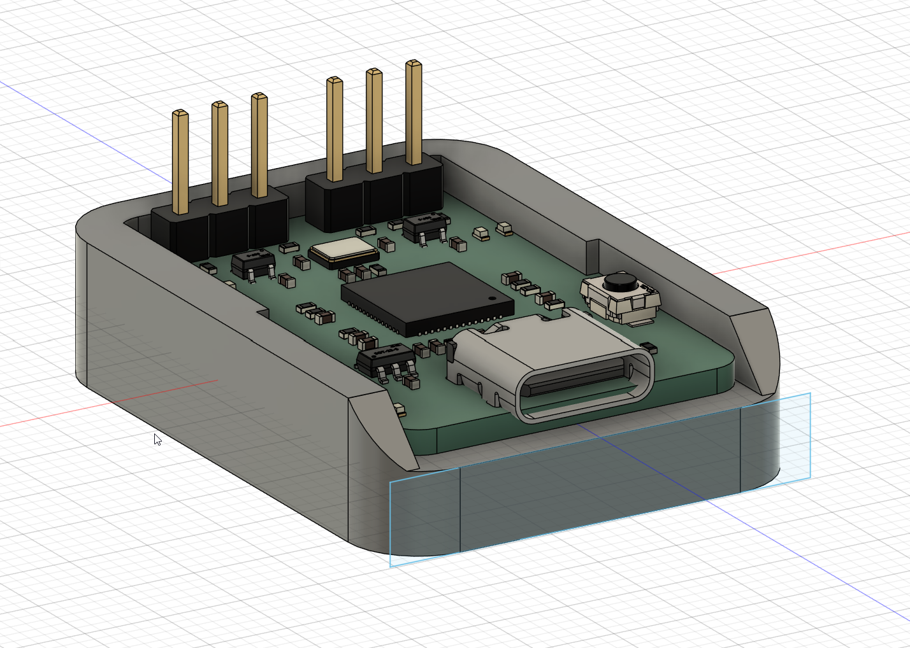

So I went ahead and decide to create a tiny snap fit/press fit type of case.

Started off by just creating like an enclosure and splitting it into two parts.

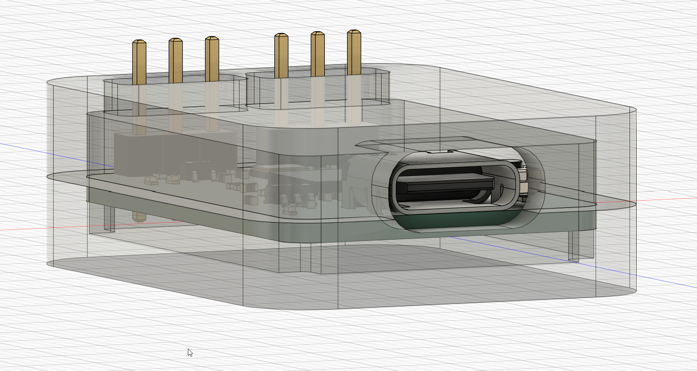

I then extruded a part of the top case down into the bottom part and then cut it out from the bottom part.

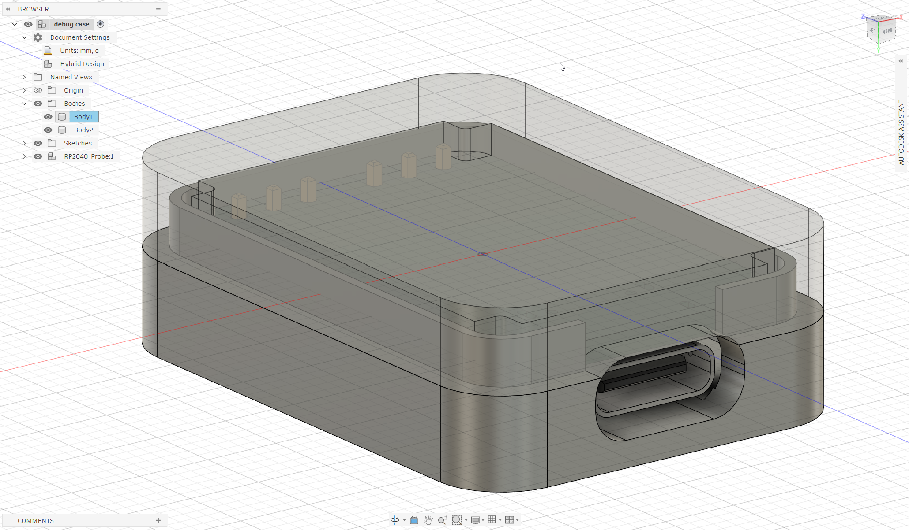

I added 0.2mm offsets to everything to account for printer tolerance and then printed a draft version which fit together pretty good.

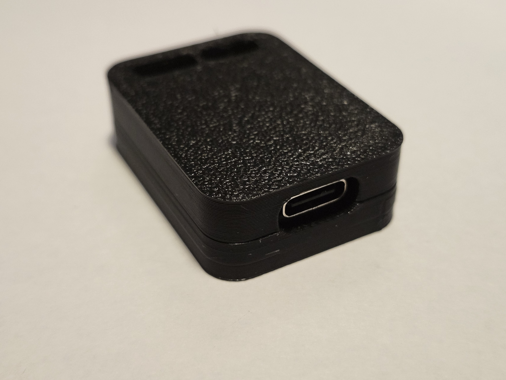

Knowing that the press fit design works, I added more features like these two extrusions you see in the middle to pinch the PCB and ensure it doesn't rotate inside the case.

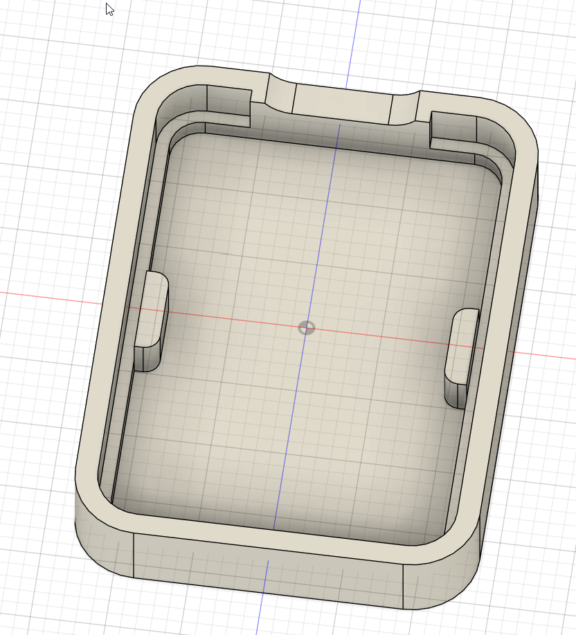

On the top part I added these hollow parts in the wall right above where the LEDs are so they could be seen through the plastic.

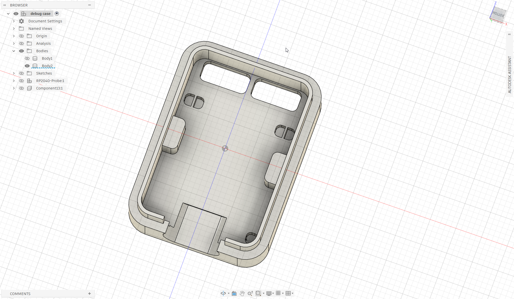

And after that I did a bunch of tries to get a raspberry pi logo on the top case.

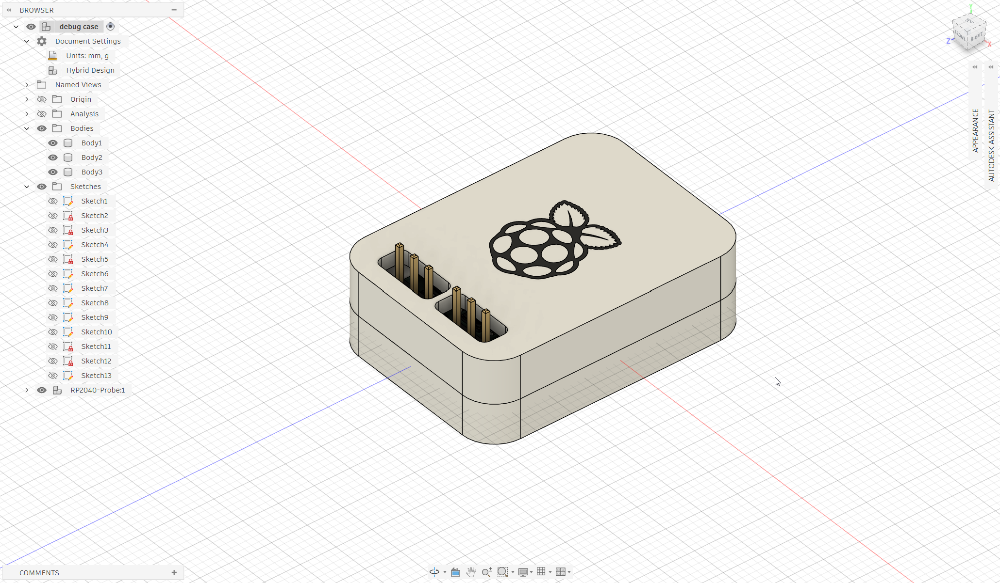

This one had the logo too small so it couldn't print properly, I tried resizing and exporting a few different times to look in the slicer and nothing really worked (well). So I decided to actually negative of the shape and extrude that into black so its easier to print.

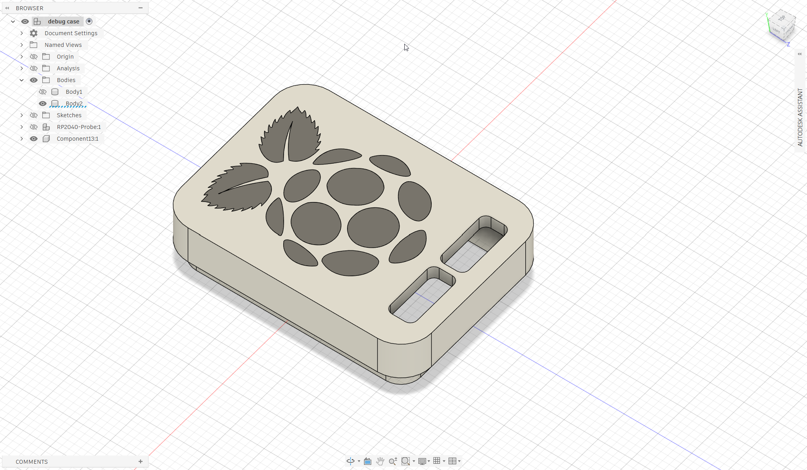

I spent like a solid 20 minute in Bambu Studio trying to figure out how to print this without an AMS and I was stuck trying to figure out how to get the black part to print first and not the white. I kept searching in parts setting but it eventually turns out you can set the sequence by clicking on the gear icon that shows up next to the build plate.

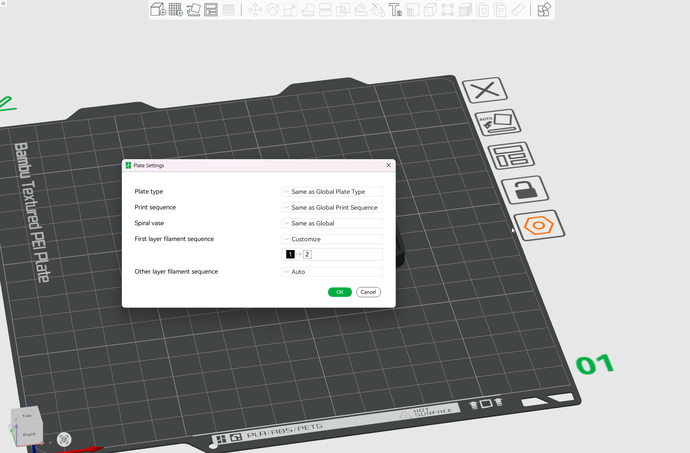

this is what my top printed case looked like irl.

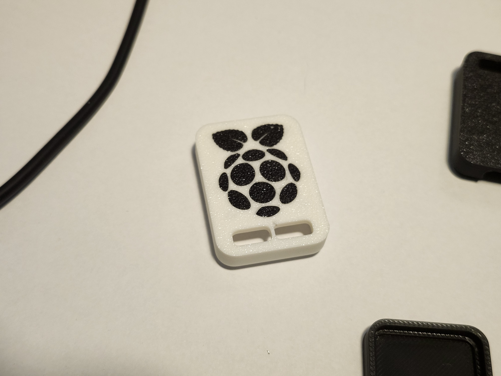

pretty sick!

I put the debug probe PCB inside the case and plugged it in but nothing happened. I was kinda scared but it took me a while to realize the USB-C connector was a bit loose and that was causing the problem.

So I threw the board back onto the reflow board to fix the connections, but as I was taking it off It slipped and fell on the ground. This was actually painful and my heart dropped, fortunately due to surface tension most of the components stayed on the board. Only the USB-C connector, Crystal and the LDO fell off which I reflowed back on. For good measure I soldered my USB-C connectors' mounting holes with better leaded solder compared to the bismuth solder. While here I also noticed that my RP2040 had a bridged pin so I fixed that with a knife tip pinecil and some flux.

I plug it back in an voila it works :D

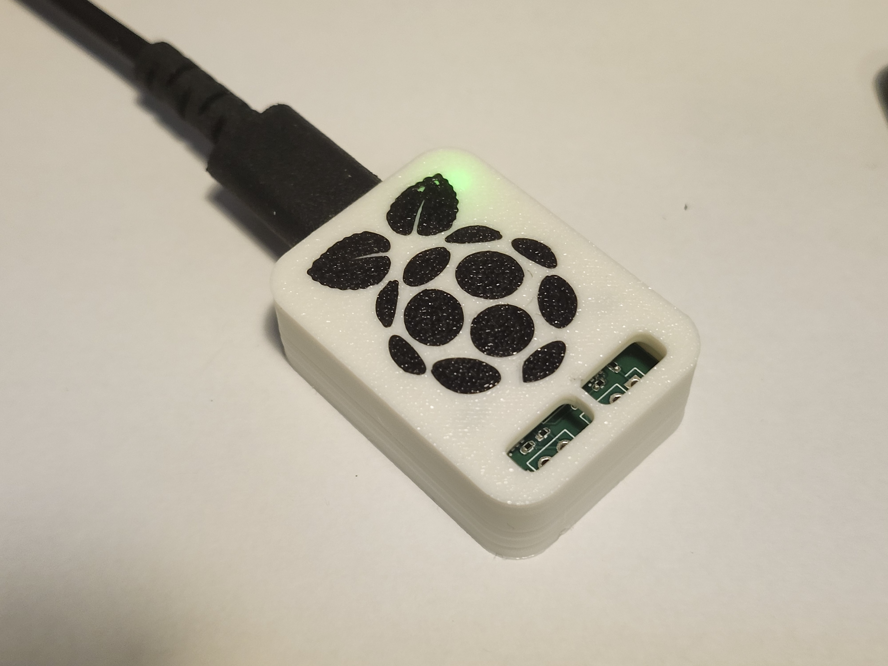

### Time Spent: 3 Hours

---
## 22 March, 2026 - Polishing Repo

I basically just polished up the repository today, added all the new CAD files, improved the README and added firmware and case sections.

I also did a little case animation in Fusion360 which looks pretty cool.

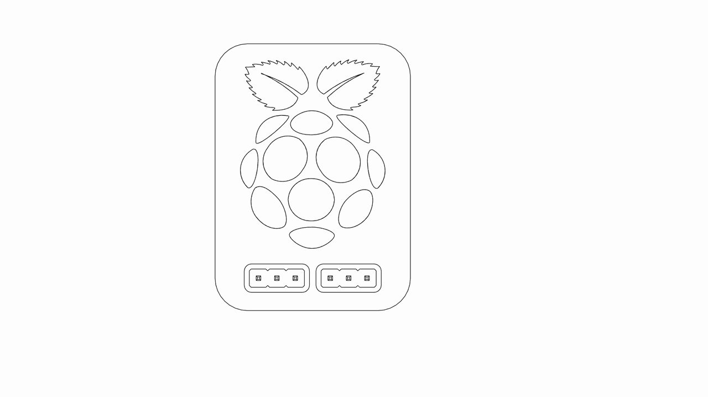

Also did some writeups for reddit posts which I'm going to make tomorrow.

### Time Spent: 1 Hour