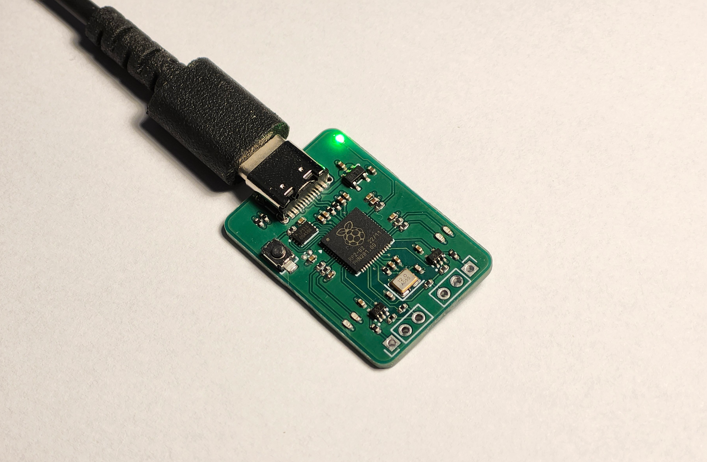
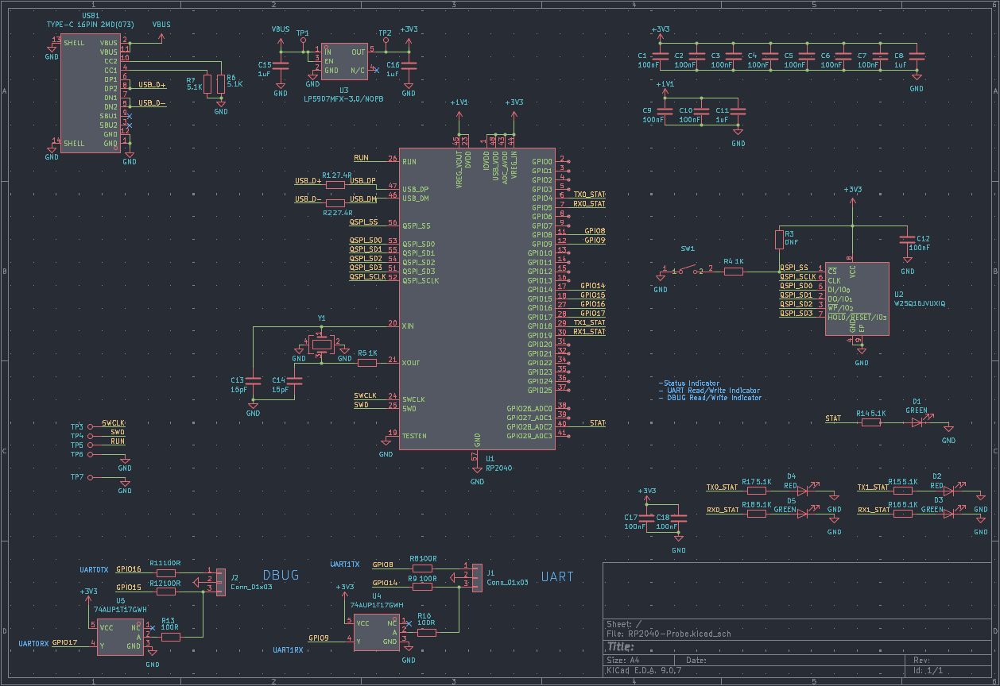
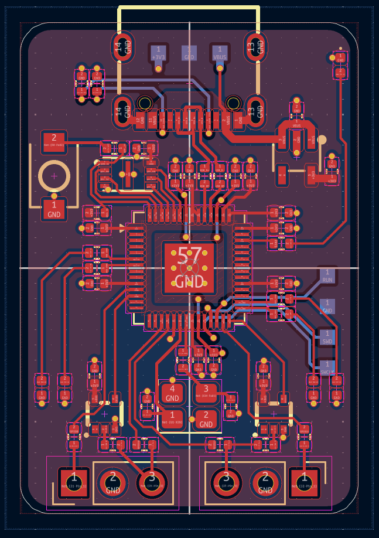
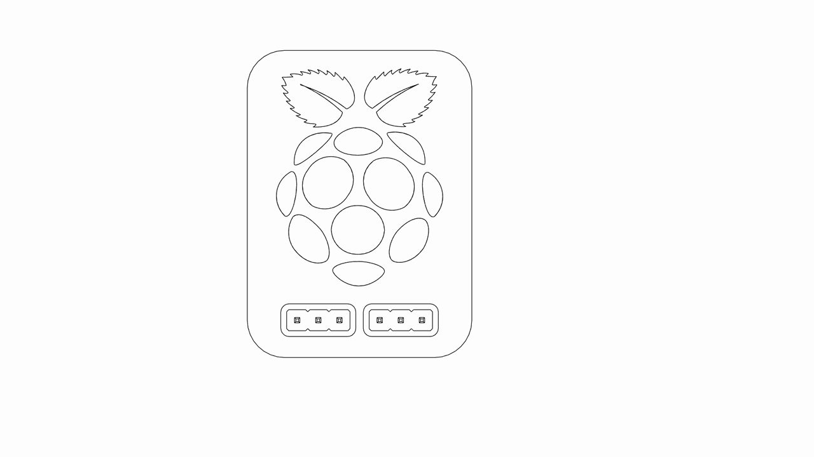

# RP2040 DBUG Probe

A RP2040 based debug probe; A USB device that provides a UART serial port and SWD interface.
Inspired by the [Raspberry Pi Debug Probe](https://www.raspberrypi.com/documentation/microcontrollers/debug-probe.html) I wanted to make my own debug probe as a fun project but implement custom features like a Type-C connector and regular (non JST) connectors while still keeping the original board footprint.


## Features

- RP2040 MCU (Duh)
- 16Mbit Flash
- USB-C Connector 
- 32mm X 22mm Board Footprint
- USB to UART/SWD Interfaces With Level Shifters
- Uses regular 2.54mm Pitch Headers
- Status LEDs for serial interfaces and power

## Table of Contents

- [Overview](#rp2040-dbug-probe)
- [Quick Start](#quick-start)
- [Hardware](#hardware)
	- [Pinout](#pinout)
	- [Schematic](#schematic)
	- [PCB](#pcb)
	- [Case](#case)
	- [BOM/Reproduction](#bomreproduction)
- [Firmware](#firmware)
- [License](#license)

## Quick Start

1. Hold the button on the board while plugging in the USB-C cable.
2. The board will appear as a mass storage device.
3. Drag and drop the `debugprobe.uf2` file from `/firmware` onto the device.

The RP2040 will reboot, and the status LED should turn green. It’s now ready to use as a USB-to-UART/SWD bridge.

To use it as a USB-to-UART adapter, open the corresponding COM port in your preferred tool and start communicating.

## Hardware

### Pinout


### Schematic

Schematic pdf is available under the `/hardware/PCB` folder and the project's KiCad files can be found under `/hardware/PCB/kicad`.



### PCB



### Case

The case files can be found under `/hardware/case`, It includes the STEP assembly file, and STLs for printing. 
Use the `top.stl` and `logo.stl` if you want to have the logo printed on top, if not use the `top_no_logo.stl`.




### BOM/Reproduction

The rough BOM can be found in [BOM.md](./BOM.md) and it assumes you'll assemble the board yourself. The rough cost for just the PCB and parts (excluding shipping) is around $24.

To build one yourself, use the files in `/hardware/production` to order the PCB and components, or opt for PCBA.

## Firmware

This project uses the [Debugprobe](https://github.com/raspberrypi/debugprobe?tab=readme-ov-file) firmware. To build one yourself for this board:

1. Clone the debug probe repository, cd into it and update the submodules.

```
git clone https://github.com/raspberrypi/debugprobe
cd debugprobe
git submodule update --init --recursive
```

2. Open  `/include/board_debug_probe_config.h` and edit the pin definitions to match the board.
   
3. Make a build directory and cd into it.

```
 mkdir build
 cd build
```

4. Run cmake and build the code.

>If your environment doesn't contain `PICO_SDK_PATH`, then either add it to your environment variables with `export PICO_SDK_PATH=/path/to/sdk` or add `-DPICO_SDK_PATH=/path/to/sdk` to the arguments to CMake below.

```
 cmake ..
 make
```

Once it successfully builds you should have a `debugprobe.uf2` file that you can upload to the board.

---

## License

This project is licensed under the CERN Open Hardware Licence Version 2 Weakly Reciprocal [(CERN OHL W)](LICENSE.txt)
